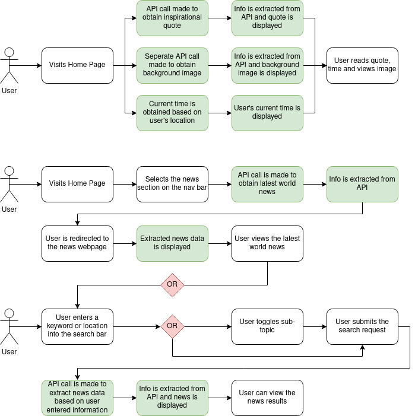

# System Requirements Document for Morning 5 Project:

## Goals:

This website provides a quick summary of news and provides an inspirational quote and image to prepare the user for a fulfilling day.

## User Stories:

1. As a user, I want to be able to view a randomly generated inspirational quote to give me positive energy.
2. As a user, I want to be able to view a randomly generated inspirational background to give me positive energy.
3. As a user, I want to be able to view the news so that I may be up to date with recent events.
4. As a user, I want to be able to specify the category of news to read (top stories, world, technology, business) to narrow down my news results.
5. As a user, I want to be able to specify the region (city or country) so that I can view news relevant to that region.
6. As a user, I want to be able to search for news articles based on keywords to narrow down my news results.

## User Flow:

- Items in white represent events where the user is interacting with the webpage.
- Items in green represents events being handled by JavaScript as a result of the user interacting with an element on the webpage.

## Business Requirements:

- Pages
  - Home Page
  - News Page
- Both Pages
  - Display a navigation bar that allows you to switch between the Home Page and News Page
  - Display the current time in the middle of the navigation bar
- Home Page
  - Display an inspiring background
  - Display an inspiring quote in the middle of the screen
    - Add a border around the quote to differentiate it from the rest of the background
- News Page
  - Contains a search bar on top to search for keywords or location to narrow the news results
  - Display a menu which allows the user to specify a sub-topic for the news as an additional filter (top stories, world news, technology, business)
  - Display the search results in the form of a card for each news article
    - Each card will show:
      - The title of the news article
      - The author of the news article
      - The publish date of the news article
      - An image accompanying the article
      - An excerpt from the article

## Technical Requirements:

- Front End using JavaScript, HTML and CSS
- API

  - Quotes API
    - [They Said So API](https://theysaidso.com/api/)
  - Background Image API
    - [Unsplash API](https://unsplash.com/developers)
  - News API
    - [NewsAPI](https://newsapi.org/)

## Optional Features:

- Translate news articles to user-selected
- Create a loading bar on/below the nav bar
- Add a carousel with several different quotes and backgrounds for the user to cycle through
